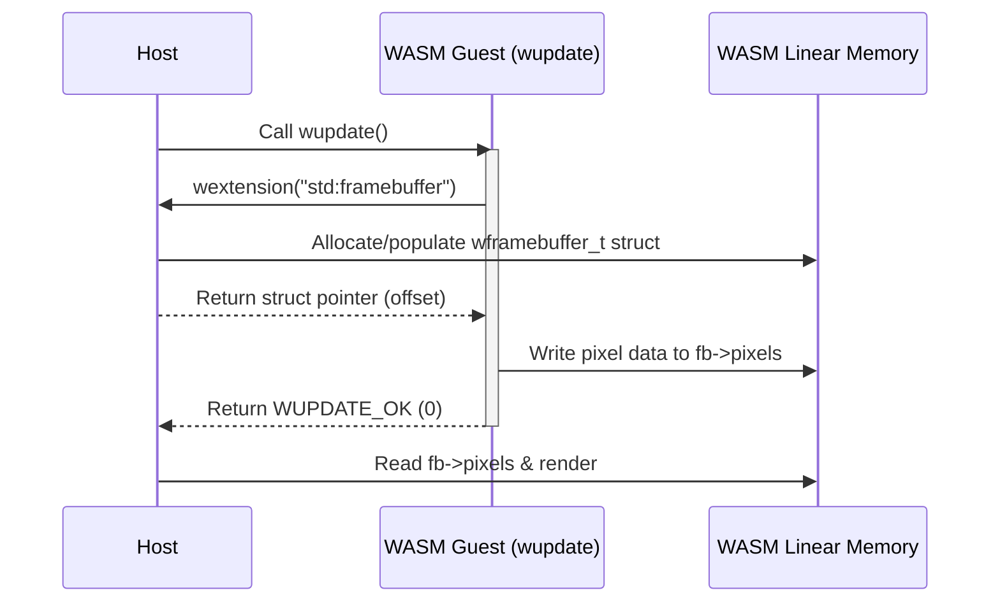

# Wagnostic 2.0 — Binary ABI Specification

This document defines the core binary Application Binary Interface (ABI) of **Wagnostic 2.0**.

The Wagnostic core ABI is an ultra-minimalist, host-agnostic, and language-neutral specification. It establishes only the basic execution lifecycle and capability negotiation mechanism between a host and a guest WebAssembly module.

All concrete capabilities (graphics, clock, input, sound, storage, network) are implemented as **extensions** negotiated dynamically at runtime. For the standard multimedia extensions specification, see [STD.md](STD.md).

---

## 1. Core Execution Model

A Wagnostic 2.0 module is a standard 32-bit WebAssembly (Wasm MVP) binary with a linear memory.

The entire interaction between host and guest is governed by exactly **two functions**:
1. **One exported entry point**: `wupdate()` (called by the host).
2. **One imported capability dispatcher**: `wextension(name)` (called by the guest).

```
┌─────────────────────────────────────────────────────────────┐
│                            HOST                             │
│                                                             │
│   Calls: wupdate() ──────────────► [ Guest Execution Step ] │
│                                             │               │
│   Resolves: wextension(name) ◄──────────────┘               │
│   Returns: pointer to extension struct in WASM Memory       │
└─────────────────────────────────────────────────────────────┘
```

---

## 2. Binary Functions

### 2.1 Guest Export: `wupdate`

Every Wagnostic module must export the `wupdate` function.

```c
int32_t wupdate(void);
```

- **WASM Type Signature**: `(func (export "wupdate") (result i32))`
- **Invocation**: The host invokes `wupdate()` periodically (e.g. once per frame at 60 Hz, or on every tick/step in headless runners).
- **Return Codes**:
  - `0` (`WUPDATE_OK`): The frame/step executed successfully. The host proceeds to the next iteration.
  - `1` (`WUPDATE_EXIT`): The guest module requests a clean shutdown. The host terminates execution loop.
  - `<0` (`WUPDATE_ERROR`): Fatal error during guest execution.

---

### 2.2 Host Import: `wextension`

The host provides a single import under the `"env"` module namespace:

```c
void* wextension(const char *name);
```

- **WASM Type Signature**: `(import "env" "wextension" (func (param i32) (result i32)))`
- **Parameters**:
  - `name`: 32-bit byte offset in WASM linear memory pointing to a null-terminated UTF-8 string identifying the extension (e.g., `"std:framebuffer"`, `"logger"`).
- **Return Value**:
  - A 32-bit byte offset in WASM linear memory pointing to the extension's memory block/struct.
  - Returns `0` (`NULL`) if the host does not support or recognize the requested extension.

---

## 3. Extension Memory Model

Wagnostic does **not** enforce rigid metadata, mandatory headers, or boilerplate fields at the beginning of extension structs. An extension is simply a named memory structure agreed upon between host and guest.

### 3.1 Memory Rules
- **Linear Memory Ownership**: Extension structs reside in the guest module's WebAssembly linear memory. The host allocates them in a dedicated host-reserved arena or mapped region within the guest's linear memory.
- **Pointer Representation**: Any internal pointers (e.g. buffer locations) are 32-bit byte offsets from the start of the WASM linear memory (`0x00000000`).
- **Endianness**: All 16-bit, 32-bit, and 64-bit integer and floating-point values are strictly **Little-Endian**.
- **Alignment**: Struct fields are aligned to their natural size (4-byte alignment for 32-bit fields, 8-byte alignment for 64-bit fields).

---

## 4. Capability Negotiation Lifecycle



1. During `wupdate()`, the guest queries desired capabilities by calling `wextension(name)`.
2. If supported, the host provides a memory struct initialized with its capabilities and returns its offset.
3. If unsupported, the host returns `0` (`NULL`). The guest must handle missing extensions gracefully.

---

## 5. Standard Extensions

The official standard library of extensions is specified in **[STD.md](STD.md)**:

- `std:framebuffer`: 32-bit RGBA8888 raster graphics buffer (`width`, `height`, `pixels`).
- `std:clock`: Monotonic timing and frame delta (`ticks`, `frequency`, `delta`).
- `std:keyboard`: Keyboard input state (256 USB HID scancodes).
- `std:mouse`: Mouse pointer coordinates, button bitmask, and wheel deltas.
- `std:gamepad`: Gamepad button bitmask and 8 analog axes.
- `std:gif`: Headless GIF recording synchronization.
- `logger`: Text logging buffer.

---

## 6. Official Runners & Minimal Templates

- **`runners/native/`**: 100% `libc` / POSIX C runner with wasm3. Renders ANSI TrueColor half-blocks (`▀`) in terminal with headless GIF export. Zero external windowing dependencies.
- **`runners/node/`**: Universal zero-dependency JavaScript runner compatible with **Node.js** and **txiki.js (`tjs`)**.
- **`examples/bare_runner.c`**: Minimal standalone C host (~90 lines).
- **`examples/bare_runner.js`**: Minimal standalone JavaScript host (~60 lines).
